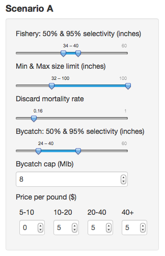

## Managment Strategy Evaluation App
This application is used to review simulation results from the Operating model.

Overarching objectives for procedure development:

* Biological sustainability – identify stock conservation objectives
* Fishery (all directed fisheries) sustainability and stability – identify harvest minimum and
	acceptable variability
* Assurance of access – minimize probability of fishery closures
* Minimize bycatch mortality
* Serve consumer needs

## Equilibrium Interface

The objective of the equilibrium model interface is to better understand the relationship and tradeoffs between policy variables (fishing mortality, size limits, discard mortality rates, etc.) and response variables (Yield, discards and wastage in the directed fishery).  The tool can be used to explore options for increasing total value in the directed fishery for a given price structure by changing policy variables suc as size-limits or bycatch mortality caps.

The interface allows you to compare two alternative Scenarios (A & B).  There are 6 components that can be adjusted:

* Fisheries selectivity- use the sliders to set the size (inches) in which 50% and 95% of the fish are vulnerable to the fishing gear.
* Miniumu and maximum size limits- use sliders to set the minimum and maximum size-limit (inches) for the directed fishery.
* Discard mortality rate- adjust the slider to set the average discard mortality rate for the directed fishery.
* Average selectivity in bycatch fisheries- use sliders to adjust the ascending limb at wich 50% and 95% of the fish are vulnerable to the fishing gear.
* Bycatch Mortality Cap (Million lb)- Total amount of halibut bycatch mortality by all other fleets.
* Price per pound ($)- four different size grades (in pounds) for which the average price per pound (excluding #2s).

The harvest policy variables can be set indpenedently for Scenarios A or B.

## MSE Interface
### Scenarios

----

### Procedures

